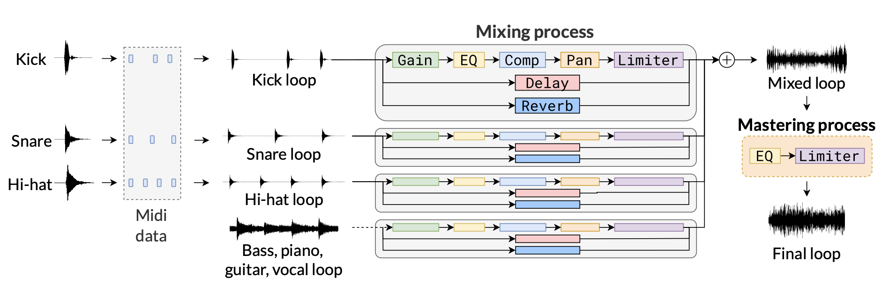

# DOSE : Drum One-Shot Extraction
This repository contains the inference script for the DOSE model. 

You can view the demo results in the demo section. 

You can also check the dataset information.


Drum one-shot extraction task. Given an audio mixture as input, the task aims to output one-shot audio samples for kick, snare, and hi-hat drums.

The input audio mixture is encoded into a sequence of discrete tokens using a frozen DAC encoder, which are then fed into a decoder-only Transformer. The Transformer is trained to autoregressively predict the groundtruth drum one-shot tokens by minimizing two losses: onset loss and full-length loss. Finally, the predicted token sequence is decoded into drum one-shot audio using the DAC decoder.

## How to Run

1. **Clone the Repository:**
   ```bash
   git clone https://github.com/HSUNEH/DOSE.git
   cd DOSE
2. **Install Dependencies**


    This code works with Python 3.10.13.
    ```bash
    pip install -r requirements.txt
    ```
    install pymixconsole
    ```bash 
    pip install git+https://github.com/csteinmetz1/pymixconsole
    ```
    install sox (soxbindings(==1.2.3))
    ```bash
    conda install -c conda-forge sox
    sudo apt-get install sox libsox-dev
    ```
3. **Download Model**


    download and locate .ckpt files in ./checkpoints/


    kick.ckpt : https://drive.google.com/file/d/1qgCSwOv43AZNviVKy1rO_FBuuqsj1oGP/view?usp=sharing
    snare.ckpt : https://drive.google.com/file/d/1FN3Zqvnng_PDsXQ-T6Un87yjU85Gx-4H/view?usp=drive_link
    hihat.ckpt : https://drive.google.com/file/d/1jtBvDYHDVo8k7gY2_TX_3UucDQ-LJwmP/view?usp=drive_link
4. **Evaluation**
    ```bash
    python eval.py
    ```
    - `--inst`: Specify the type of drum instrument to extract. Options are `kick`, `snare`, or `hihat`.
      Example: `python eval.py --inst kick`
    
    - `--i`: Specify the input directory containing the wav files.
      Example: `python eval.py --i ./wavs`
    
    - `--o`: Specify the output directory where the results will be saved.
      Example: `python eval.py --o ./results`
    
    - `--d`: Specify the device to use for computation. Options are `cpu` or `cuda:<device_number>`.
      Example: `python eval.py --d cuda:0`


## 🎧 Check Demo 
https://hsuneh.notion.site/DrumSlayer-110005fe1b9443f58668c999c81c5745?pvs=4

## RMOD (Random Mixture One-shot Dataset)

Dataset generation process. First, kick, snare, and hi-hat loops are synthesized from one-shot drum audio samples using randomly generated MIDI notes. Next, optional bass, piano, guitar, and vocal loops are selected. The drum loops and other musical loops are then processed through independent mixing chains, which apply gain, EQ, compression, panning, limiting, delay, and reverb effects. Finally, all tracks are combined and passed through a mastering chain consisting of EQ and limiter effects.

### You can download RMOD from Kaggle.(10000 files)

https://www.kaggle.com/datasets/sunehflower/random-mixture-one-shot-dataset-rmod

## Results
